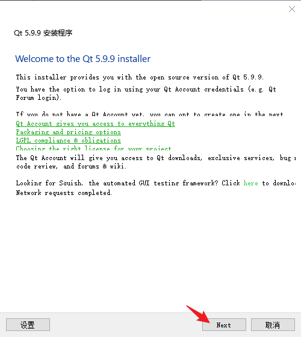
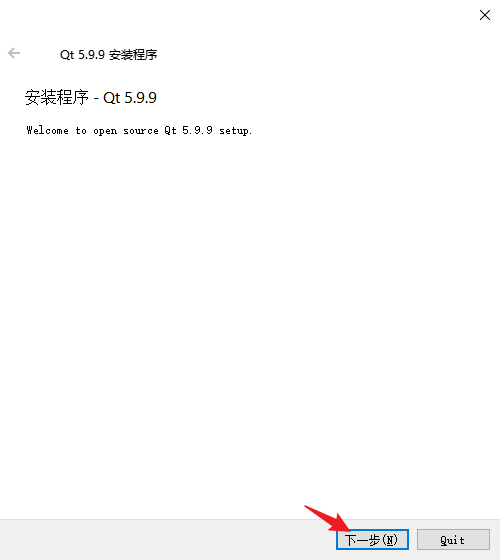
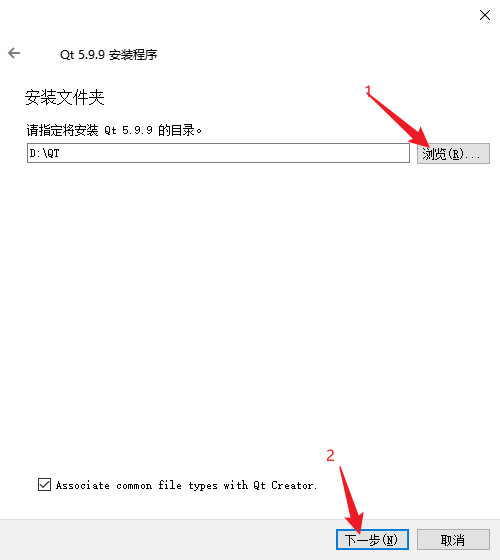
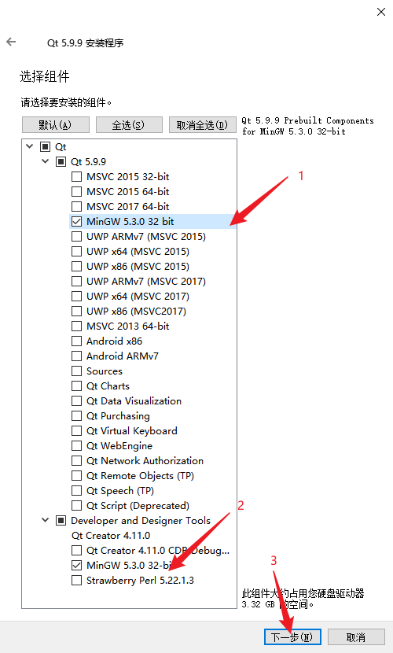
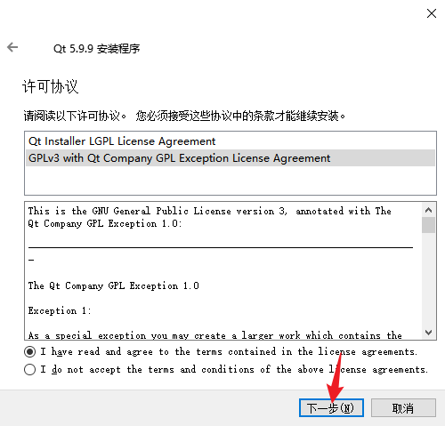
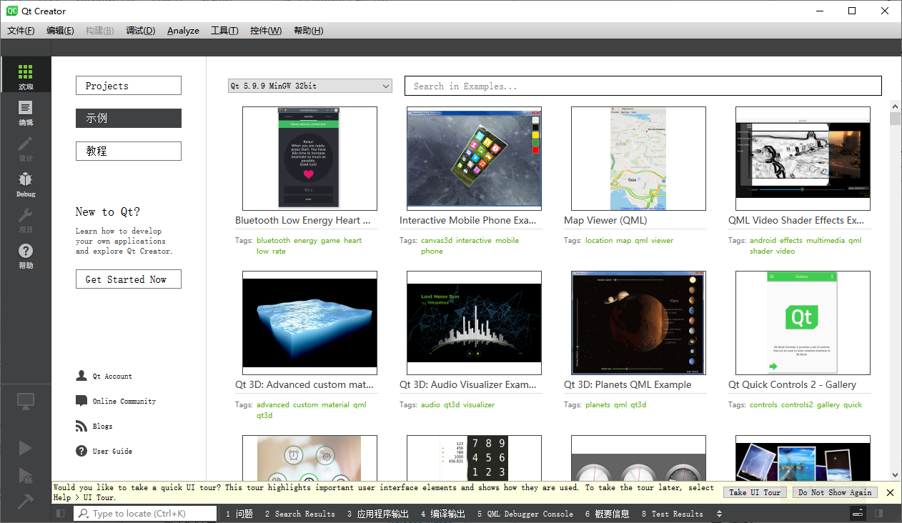
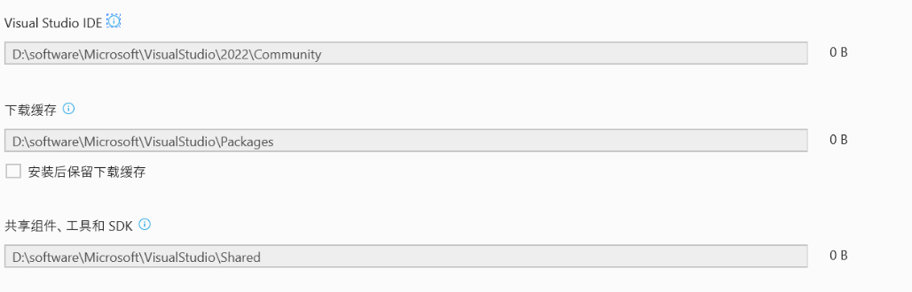
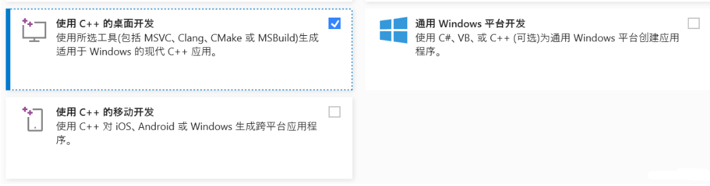
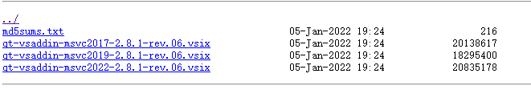

环境配置：

#### QT安装

安装版本为5.9.9

进入[Index of /qtproject/archive/qt/5.9/5.9.9/ (ustc.edu.cn)](http://mirrors.ustc.edu.cn/qtproject/archive/qt/5.9/5.9.9/)，根据如下索引

这里是windows环境，所以下载`qt-opensource-windows-x86-5.9.9.exe`

下载完成之后，开始安装教程，第一步点击next

第二步，输入自己的账号，然后next。

第三步，点击下一步

第四步，可以选择修改安装地址，也可以不选择，这里我安装到了D盘

第五步，这里需要选择一下

MSVC  开头的是  针对Windows平台上的MSVC编译器的Qt组件，安装这类组件需要计算机上有对               应版本的Visual Studio。

UWP  开头的是有不同编译器类型的UWP，属于MSVC编译器生成的Qt库。

如果这是在Qt上做编程的话，不建议安装。

MinGW 5.3.0 32 bit  是Windows平台上使用的GUN工具集导入库的集合。

Android  开头的是 针对安卓应用开发的Qt库。如果不针对安卓应用开发不建议安装。

Sources 是Qt的源代码包。不建议安装。

Qt  开头的是附加模块，如果深度学习的我比较建议安装。（因为是在网吧，所以我没有安装。）        其中末尾带（TP）的是还在测试阶段，功能还不齐全；末尾带（Deprecated）的是被抛弃的          旧模块，对于我们新学Qt的这个不建议安装。

Qt Creator 是集成开发环境  强制安装的

Qt Creator 4.11.0 CBD Debugger surpport  一般用于调试VC编译的Qt程序。不建议安装

Strawberry Perl 5.22.1.3 用于编译Qt源代码的Perl开发环境。不建议安装。

这里直接开始下一步，进行安装

最后安装完成，打开如下：

#### VS studio安装

官网下载地址：
https://visualstudio.microsoft.com/zh-hans/downloads/

下载社区版即可

下完完成后，双击打开后，会加载一些东西。最后出现下面的界面

**选择位置**

首先，我们要设置一下安装路径。因为visual studio占用的空间十分大，我们千万千万不要把它一股脑地安装在C盘，这会让我们本来就贫乏的C盘空间，雪上加霜。在这里，切换到安装位置，将下述三项的路径改成D盘或其他非系统盘，这里图片是我已经改完了的。

**自定义安装组件**

点击安装即可。记得留下最开始的安装文件，如果以后有其他的扩展或者修改，都可以使用它。

#### 在VS上配置QT

1、根据自己的vs版本在镜像源内找到插件包（博主的是2022的版本）
镜像地址：[镜像地址](http://mirrors.ustc.edu.cn/qtproject/official_releases/vsaddin/)

