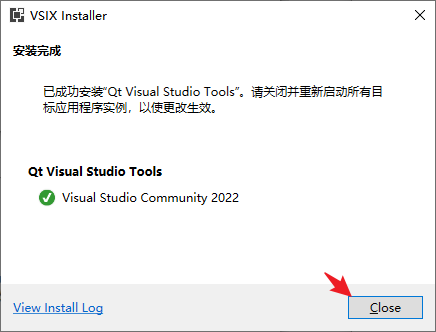
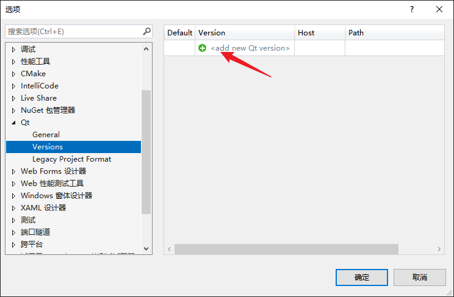

环境配置：

#### QT安装

安装版本为5.9.9

进入[Index of /qtproject/archive/qt/5.9/5.9.9/ (ustc.edu.cn)](http://mirrors.ustc.edu.cn/qtproject/archive/qt/5.9/5.9.9/)，根据如下索引

这里是windows环境，所以下载`qt-opensource-windows-x86-5.9.9.exe`

下载完成之后，开始安装教程，第一步点击next

第二步，输入自己的账号，然后next。

第三步，点击下一步

第四步，可以选择修改安装地址，也可以不选择，这里我安装到了D盘

第五步，这里需要选择一下,这里需要安装MSVC 2017，最新版的vs2022，以及qt vs插件是不能添加MinGW的，至少我这里不行，但是安装MSVC是没有问题的。

这里直接开始下一步，进行安装

最后安装完成，打开如下：

#### VS studio安装

官网下载地址：
https://visualstudio.microsoft.com/zh-hans/downloads/

下载社区版即可

下完完成后，双击打开后，会加载一些东西。最后出现下面的界面

**选择位置**

首先，我们要设置一下安装路径。因为visual studio占用的空间十分大，我们千万千万不要把它一股脑地安装在C盘，这会让我们本来就贫乏的C盘空间，雪上加霜。在这里，切换到安装位置，将下述三项的路径改成D盘或其他非系统盘，这里图片是我已经改完了的。

**自定义安装组件**

点击安装即可。记得留下最开始的安装文件，如果以后有其他的扩展或者修改，都可以使用它。

#### 在VS上配置QT

1、根据自己的vs版本在镜像源内找到插件包（博主的是2022的版本）
镜像地址：[镜像地址](http://mirrors.ustc.edu.cn/qtproject/official_releases/vsaddin/)

载完成后直接打开软件界面如下所示，点击安装
注意！！！【安装的时候关闭你的vs】

安装完成

vs扩展界面显示插件即表示安装成功

然后我们找到qt的版本位置

然后点击添加

点击路径

找到你的qt所在的位置，我的位置在这里

最后点击确认

接下来创建一个项目

这里我们创建一个UI界面

然后设置文件目录，点击创建

接下来开始配置qt的设置，点击next。

接下来就是配置Debug和Release版本，如果你有其他需求可以进行配置，没有的话，这里直接点击下一步就可以了，需要添加新的配件在之后也可以进行扩展。

看你自己的命名习惯需不需要修改什么，没有要求点击完成即可。

生成新的代码之后，点击运行即可，最后看到如下界面，就是正确的

安装完成，可以开始你自己的学习了。

